# 🚢 Battleship Game (JavaScript)  
Projeto desenvolvido no **The Odin Project** | Project developed at **The Odin Project**  

[English](#en) | [Português Brasileiro](#pt-br)  

---

## 🛠️ Technical Skills Demonstrated  
- **DOM Manipulation**: Dynamic board rendering, ship placement visualization  
- **Game State Logic**: Algorithm for random ship placement + hit detection  
- **Input Validation**: Coordinate checks, attack repetition prevention  
- **Event Handling**: Turn-based flow with AI interactions  
- **Error Handling**: Graceful failure management for edge cases  

## 🎯 Relevance for QA Automation  

1. **Test Scenario Simulation**:  
   Similar sequencing required for E2E test automation (login → add item → checkout)  
2. **State Validation**:  
   "Ship hit" detection parallels UI element assertion in Selenium/Cypress  
3. **Edge Case Coverage**:  
   Handling invalid attacks mirrors testing boundary conditions in forms/payment flows  

▶️ **[Play Live Version](https://derre3.github.io/Battleship/)**  

---

## 🛠️ Habilidades Técnicas Demonstradas  
- **Manipulação de DOM**: Renderização dinâmica do tabuleiro, visualização de navios  
- **Lógica de Estado**: Algoritmo para posicionamento aleatório de navios + detecção de acertos  
- **Validação de Inputs**: Verificação de coordenadas, prevenção de ataques repetidos  
- **Eventos**: Fluxo turno-a-turno com interações de IA  
- **Tratamento de Erros**: Gestão elegante de casos extremos  

## 🎯 Relevância para Automação de QA  

```mermaid
graph LR
    A[Lógica do Jogo] --> B[Sequenciamento de Testes]
    A --> C[Validação de Estados]
    A --> D[Teste de Casos Extremos]
    B --> E[Fluxos Automatizados]
    C --> F[Asserções de UI]
    D --> G[Testes de Limites]
```

1. **Simulação de Cenários**:  
   Sequenciamento similar ao usado em automação E2E (login → adicionar item → checkout)  
2. **Validação de Estados**:  
   Detecção de "navio atingido" equivale a asserções de elementos UI no Selenium/Cypress  
3. **Cobertura de Casos Extremos**:  
   Tratamento de ataques inválidos espelha testes de condições limite em formulários/fluxos de pagamento  

▶️ **[Jogar Versão Online](https://derre3.github.io/Battleship/)**  

---

## 🔧 Technical Environment | Ambiente Técnico  
`JavaScript` `Webpack` `Jest` `HTML5` `CSS3`  

## 📬 Contact | Contato  
  
[derre3@github.com](mailto:seu_email@exemplo.com)
